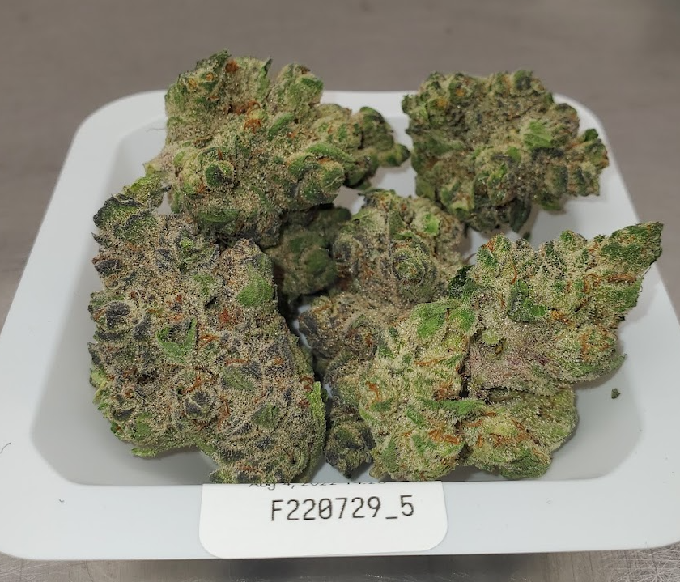
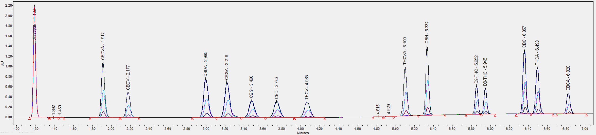

- Lab design, equipment procurement, set up, qualifications (IQOQ)
- Method development for simultaneous quantitation of 14 compounds on Waters Acuity ARC uHPLC (PQ)
- Method development for simultaneous quantitation of 14 compounds on Waters Acuity ARC uHPLC
- {:height 1048, :width 780}
  {:height 148, :width 611}
  
- 
- 
- {:height 1048, :width 780}
- 
-