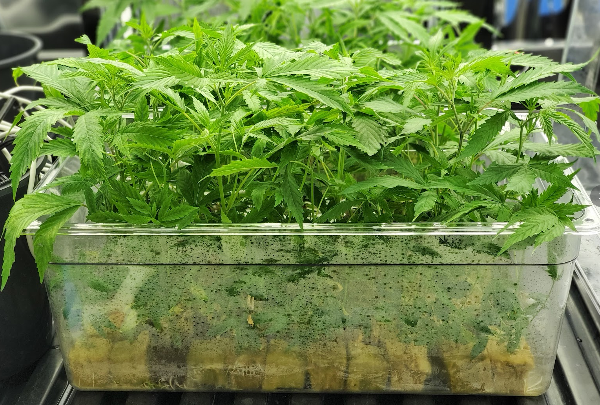
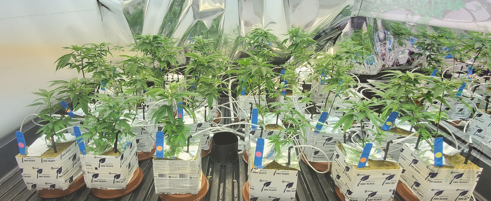

- Nesbitt, J. Small, F.A.A. Zheng, Y., Habash, M. (2022), Assessment of four biocontrol agents for their suppression of
  Fusarium proliferatum on Cannabis sativa plants in a soilless cultivation system.
  
	- 
	- 
	- 
	- 
	- 