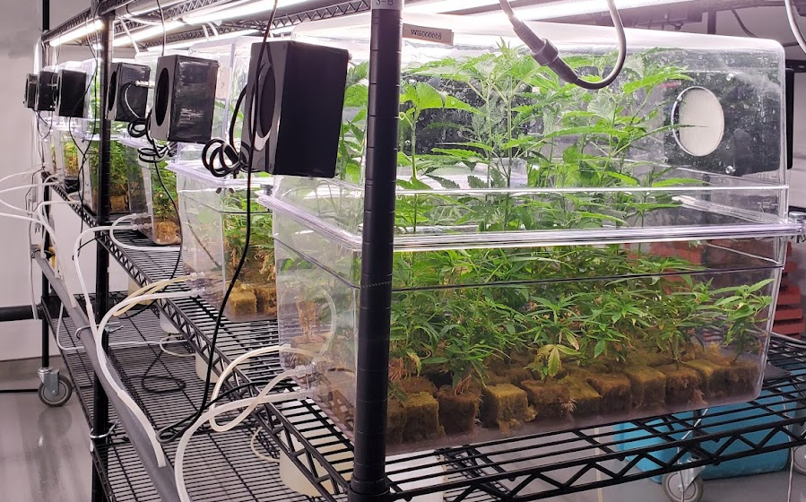

- # Hello World!
	- Welcome to Small Solutions
	- Witness the fitness
	- Ride the wave
	- Experience the sensation
- 
- # Project highlights
	- Photobiology
	- ## [[plantlet finishing chambers]]
		- 
		- 
		- 
		-
	- ## [[people counters]]
	- Modular Agricultural Controller
	- Plant Tissue Culture
	- Beneficial microbes
		- Greenhouse
		- Field
		- OCI project
	- Send It - data collection platform
	- ## NepalCanDo
	  Prospecting drought tolerant wild plants with enhanced microbial symbiosis to enhance sustainable agriculture in the mid-hills of Nepal
	-
- # Links
	- twitter
	- github, gitlab
	- Donate cash or crypto to feed me and pay my student loans
- # Site todo
	- NOW Introduction
	  :LOGBOOK:
	  CLOCK: [2023-07-03 Mon 10:25:56]
	  CLOCK: [2023-07-03 Mon 10:25:59]
	  :END:
	- NOW Design
	  :LOGBOOK:
	  CLOCK: [2023-07-03 Mon 10:24:39]
	  :END:
		- 1970s USA governmental design - NASA, EPA, Dept of Labour, NOAA
		- Federal Graphics Improvement Program
	- NOW Project highlights
	  :LOGBOOK:
	  CLOCK: [2023-07-03 Mon 10:24:48]
	  :END: