- 
- # Finlay Small
	- Resume
	  id:: 64a36b59-305f-45fa-b8cb-7984b551432c
	  https://drive.google.com/file/d/15V3KSGBV7osoUZ-4QgwHZfEtn9Y0Zhsl/view?usp=sharing
- # Project highlights
	- ## [[Inline real time spectroscopy]]
	  Process control driven by real time monitoring of solvent saturation in extraction
	- ## [[Avenue Intelligence - People Counters]] 
	  www.avenueintelligence.com
	  ARM® Cortex® M0+ Core and SX1262 on LoRaWAN
	  Infrastructure on Linux (AWS), Docker
		- {:height 259, :width 611}
		-
	- ## [[MAC 🌱 Modular Agriculture Controller]]
	  HVAC and lighting controls based on plant biofeedback
	  Advanced real time canopy segmentation from thermal camera
	  ESP32 based agricultural controller
		- 
	- ## [[Analytical Chemistry Lab 2023]]
	  Method development for simultaneous quantitation of 14 compounds on Waters Acuity ARC uHPLC
		-
		-
	- ## Automated postharvest processing system
	  Precision postharvest automation - optimising for maximum CO2 efflux
	  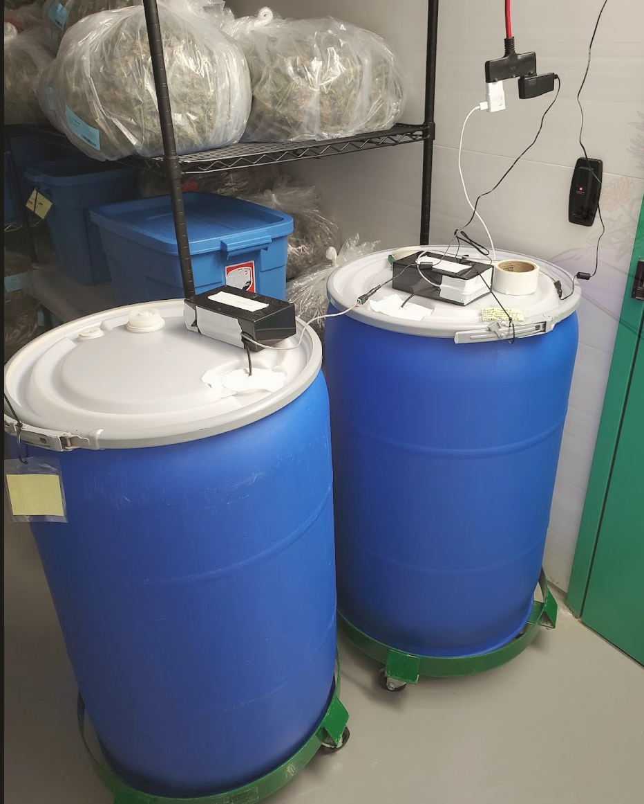
	  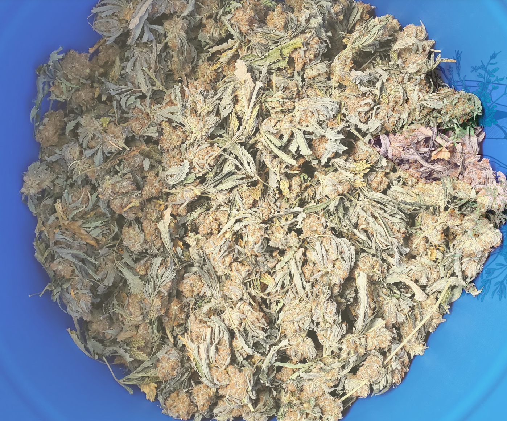
	- ## [[Plantlet Finishing Chambers]] 
	  Custom bioreactor system for acclimatizing plant tissue cultures / micropropagation
	  
	  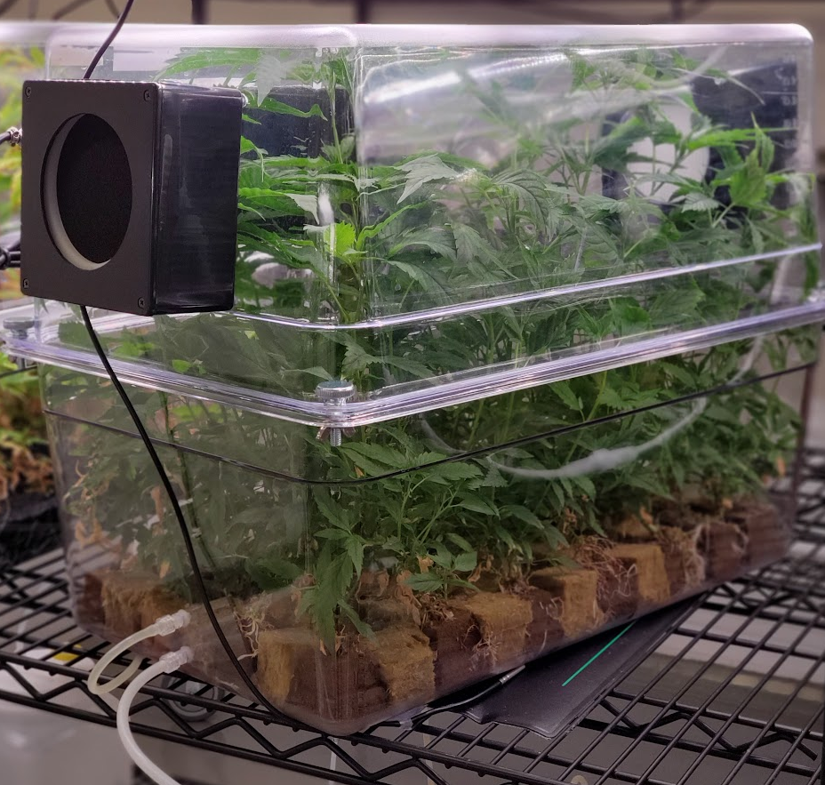
	  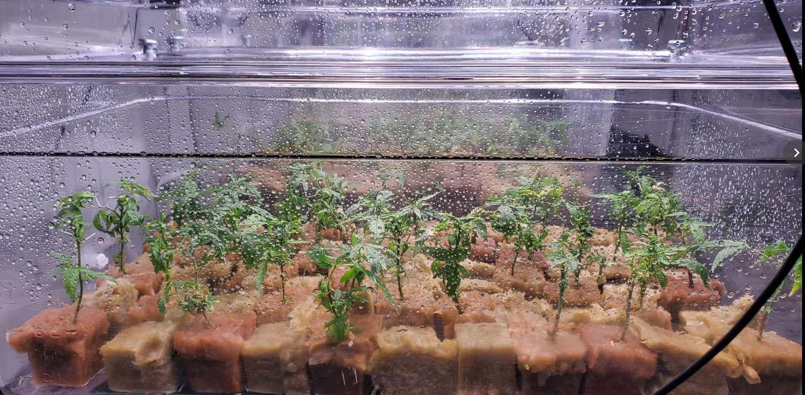
	  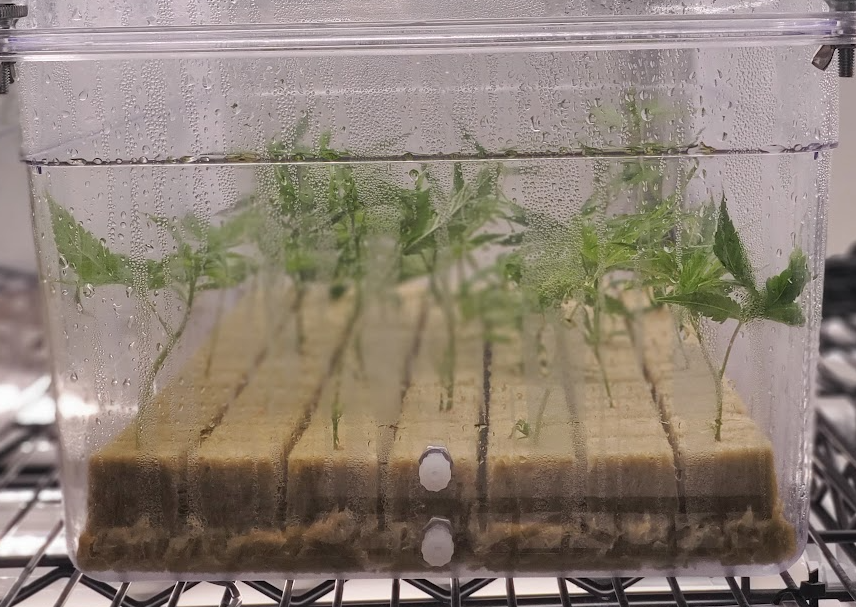
	  
	  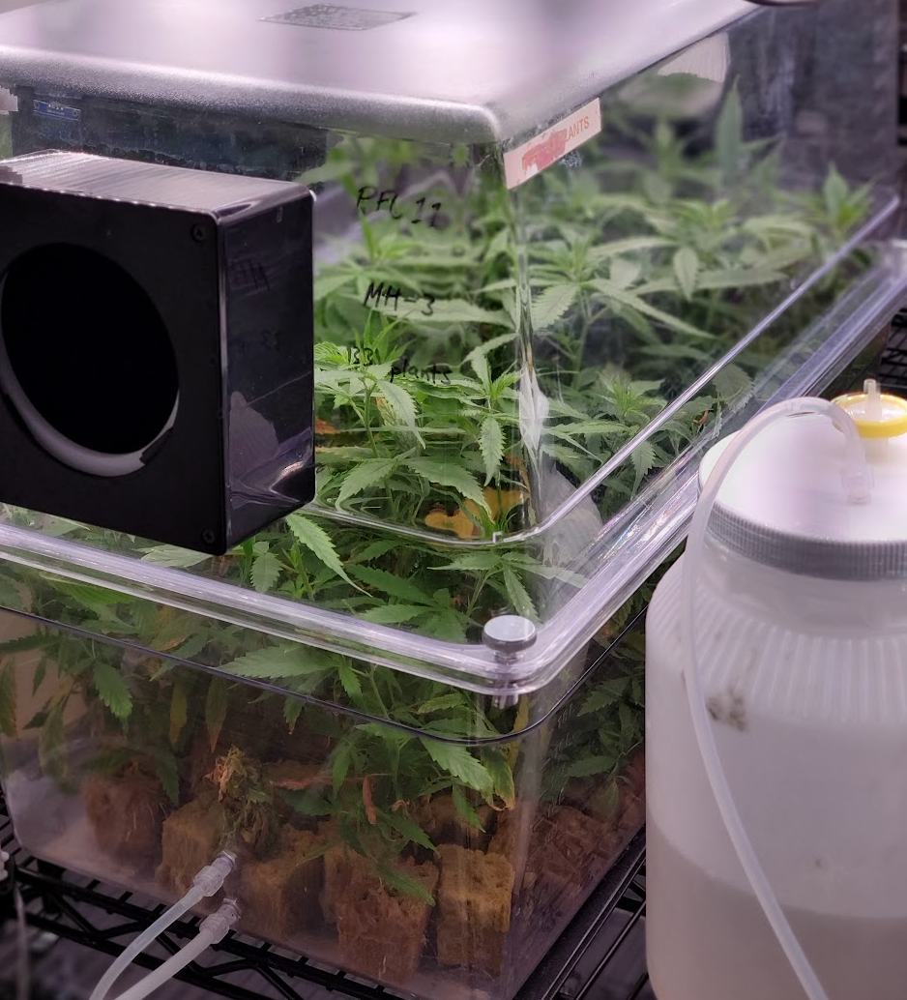
	  
	  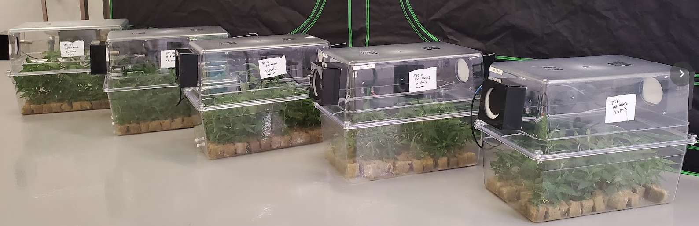
	- ## Plant Tissue Culture
	  Meristem tip dissection to eliminate pathogens from genetic library
		- Finding the best surface sterilising agent
		  
		- 2 weeks post dissection
		  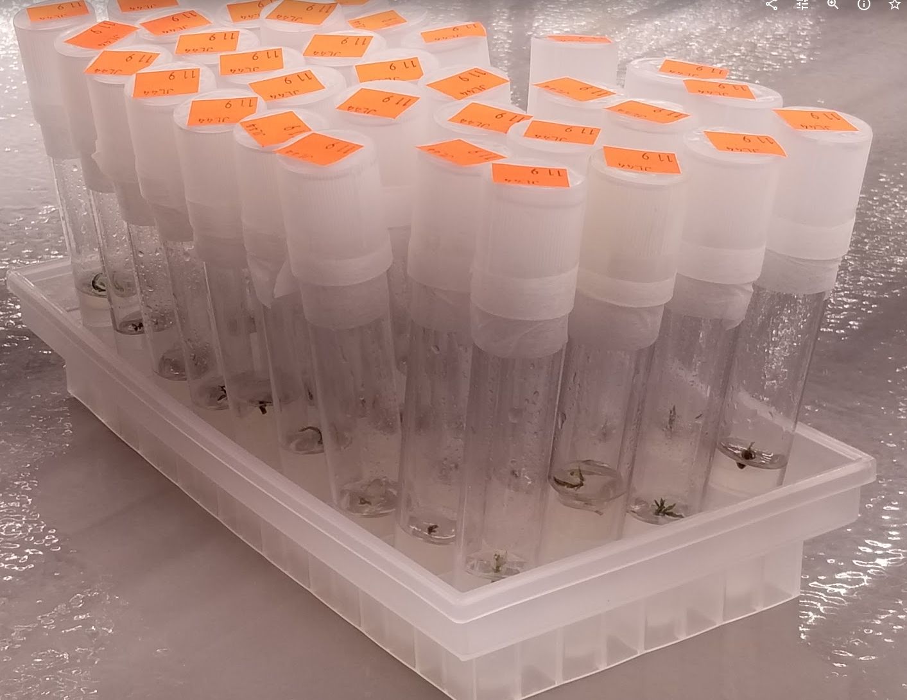
		- 3 weeks post dissection
		  {:height 416, :width 718}
	- ## Beneficial microbes
		- Greenhouse
		- Field
		- OCI project @ U of G 2020-2022
			- Nesbitt, J. Small, F.A.A. Zheng, Y., Habash, M. (2022), Assessment of four biocontrol agents for their suppression of
			  Fusarium proliferatum on Cannabis sativa plants in a soilless cultivation system.
			  
			- 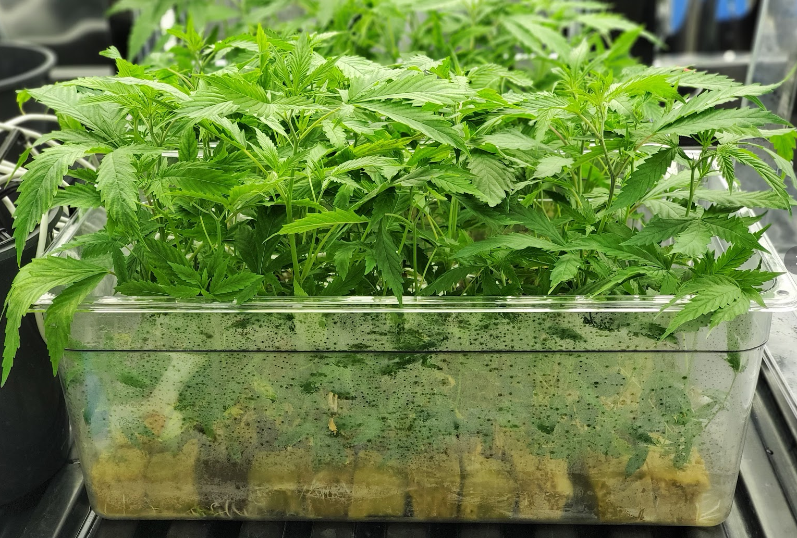
			- 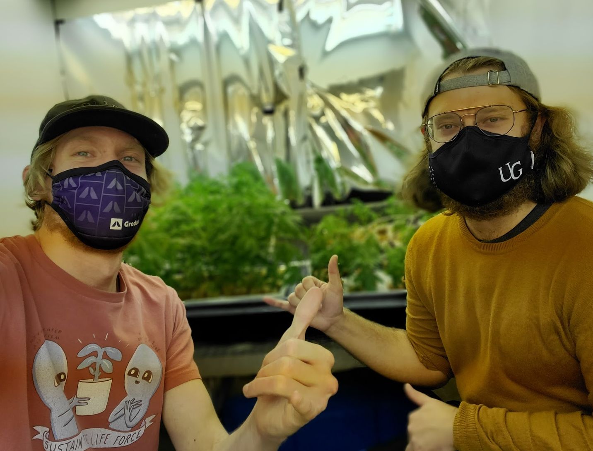
			- 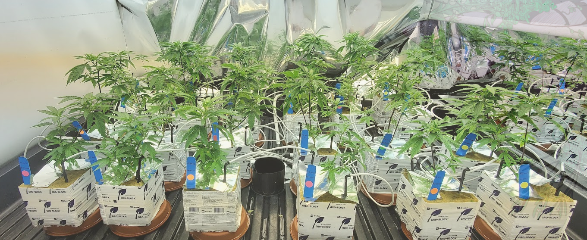
			- 
			- 
	- ## Send It - data collection platform
	- ## Photobiology lab 2019-2020
		- 
		- 
		- _1688427672718_0.png)
	- ## Tissue Culture Photobiology 2017-2022
		- Comparative Analysis of Machine Learning and Evolutionary Optimization Algorithms for Precision Micropropagation of *Cannabis sativa* : Prediction and Validation of *in vitro* Shoot Growth and Development Based on the Optimization of Light and Carbohydrate Sources
		  https://www.ncbi.nlm.nih.gov/pmc/articles/PMC8566924/
	- ## NepalCanDo
	  Prospecting drought tolerant wild plants with enhanced microbial symbiosis to enhance sustainable agriculture in the mid-hills of Nepal
	-
- # Links
	- twitter
	- github, gitlab
	- Donate cash or crypto to feed me and pay my student loans
- ## [[Wisdom]]
	- 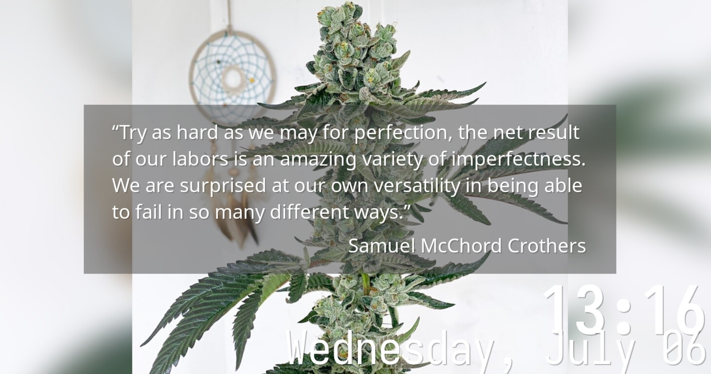
	- 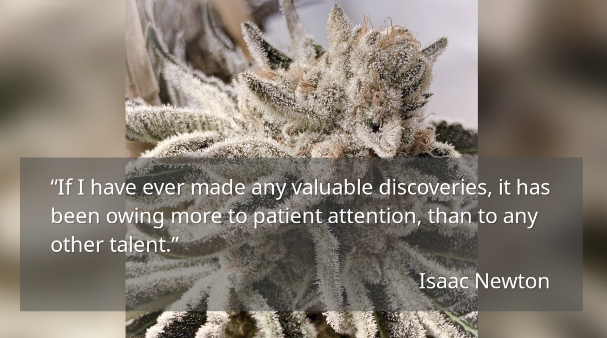
- # Site todo
	- NOW Introduction
	  :LOGBOOK:
	  CLOCK: [2023-07-03 Mon 10:25:56]
	  CLOCK: [2023-07-03 Mon 10:25:59]
	  :END:
	- NOW Design
	  :LOGBOOK:
	  CLOCK: [2023-07-03 Mon 10:24:39]
	  :END:
		- 1970s USA governmental design - NASA, EPA, Dept of Labour, NOAA
		- Federal Graphics Improvement Program
	- NOW Project highlights
	  :LOGBOOK:
	  CLOCK: [2023-07-03 Mon 10:24:48]
	  :END:
- [[smallsolutions whiteboard]]