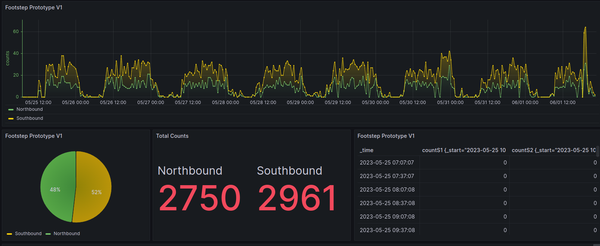
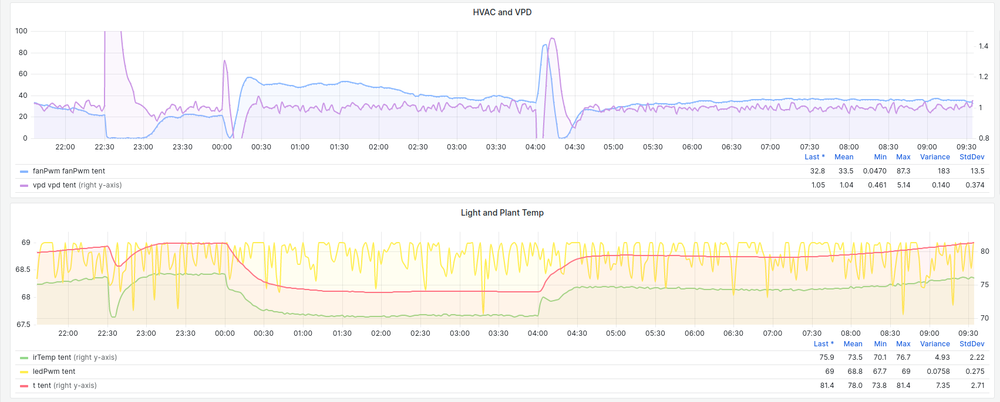
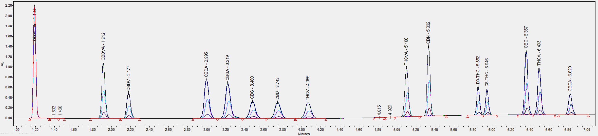
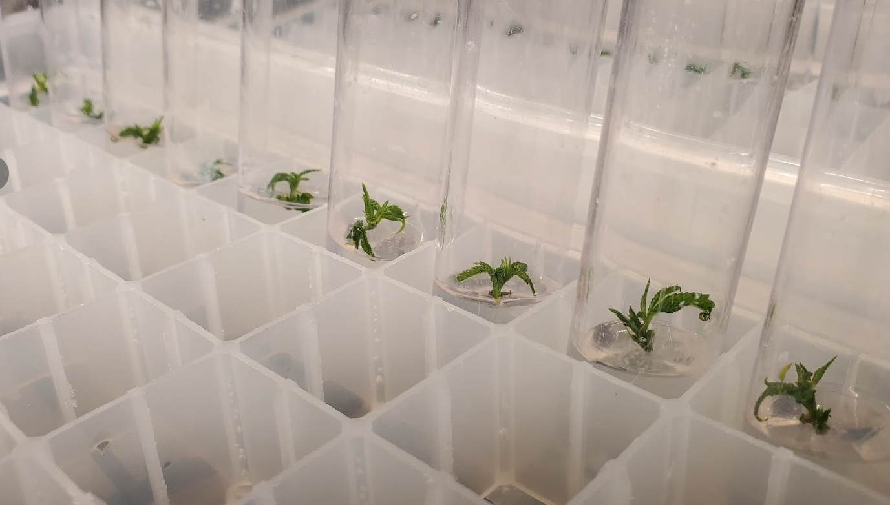
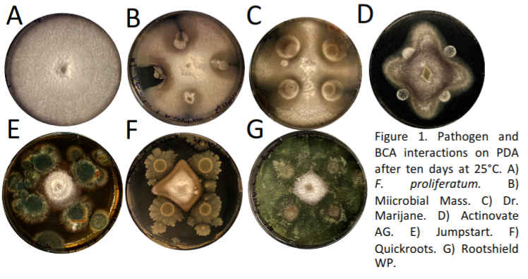
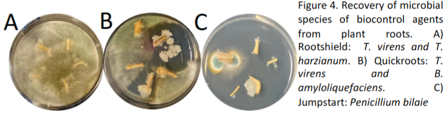
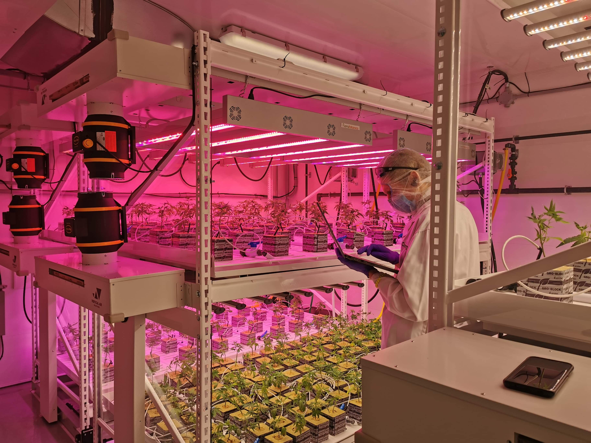

- 
- # Finlay Small
	- ## Resume
	  id:: 64a36b59-305f-45fa-b8cb-7984b551432c
	  https://drive.google.com/file/d/15V3KSGBV7osoUZ-4QgwHZfEtn9Y0Zhsl/view?usp=sharing
	- ## Skills
		- ### Technology 🤖
			- Software: Linux (on premises, AWS), Docker, Python
			- Firmware: C++ on ESP32/ESP8266
			- Data science: R, Tableau, PowerBI
			- Reporting: Markdown, Logseq, Office
			- Enjoyer of Linux, nvim, tmux ([dotfiles](https://github.com/bigFin/dotfiles/tree/sway) 🐧)
		- ### Science 🔬
			- Biotech: Tissue culture, protoplast fusion, fluorescence microscopy
			- Analytical chemistry: lab management, data management, workflow and method development, uHPLC, FTIR Spectroscopy
			- Design of experiments: media optimization, photobiology, R&D, process improvement
			- Plant breeding: organic agriculture, climate change, and low external input environments
		- ### Design 📐
			- Hardware: PCB Design KiCad, Eagle
			- Bioreactors, environmental control systems
			- 3D modelling with Fusion360 for 3D printing components
		- ### Industrial ⚙️
			- AWS and On Premises server deployment
			- Automation, custom ESP32 based hardware
			- Low-power, long range sensor networks on LoRaWAN 📡
- # Project highlights
	- ## Ongoing Projects
		- ### [[Inline real time spectroscopy 🌈]] 
		  Process control driven by real time monitoring of solvent saturation in extraction
		- ### [[Medicinal mushrooms research - U of Guelph 2023]]
		  Developing custom bioreactors for research on medicinal mushrooms
		- ### [[Avenue Intelligence - People Counters 🚶 2023]] 
		  [avenueintelligence.com](https://avenueintelligence.com/)
		  ARM® Cortex® M0+ Core and SX1262 on LoRaWAN
		  Infrastructure on Linux (AWS), Docker
			- {:height 259, :width 611}
			-
		- ### [[MAC 🌱 Modular Agriculture Controller]]
		  HVAC and lighting controls based on plant biofeedback
		  Advanced real time canopy segmentation from thermal camera
		  ESP32 based agricultural controller. Custom PCB designed in KiCAD
		  Datalogging and dashboarding with Influxdb and Grafana
			- 
		- ### [[Prismatic - Tissue Culture Photobiology 🌈 2017]]
		  Multi-channel LED system for photobiology research. Built on ESP8266.
		  https://github.com/bigFin/Prismatic
			- 2022 Publication: Comparative Analysis of Machine Learning and Evolutionary Optimization Algorithms for Precision Micropropagation of *Cannabis sativa* : Prediction and Validation of *in vitro* Shoot Growth and Development Based on the Optimization of Light and Carbohydrate Sources
			  https://www.ncbi.nlm.nih.gov/pmc/articles/PMC8566924/
			- Industrial project: light intensity effects on regeneration after droplet vitrification and cryopreservation
			- Ongoing research
	- ## Past Projects
		- ### [[Analytical Chemistry Lab 🧪 2022]] 
		  Method development for simultaneous quantitation of 14 compounds on Waters Acuity ARC uHPLC
			- {:height 1048, :width 780}
			- {:height 148, :width 611}
			- 
	- ### [[Automated postharvest processing system 🍃 2023]] 
	  Precision postharvest automation - optimising for maximum CO2 efflux
	- ### [[Plantlet Finishing Chambers 🌿 2021-2022]] 
	  Custom bioreactor system for aseptic acclimatization of plant tissue cultures / micropropagation
	  Custom design. PCBs designed in KiCAD. C++ on ESP8266. 
	  Influxdb and Grafana, Docker, Linux.
		- 
	- ### [[Plant Tissue Culture Method Development 🌱]] 
	  2019-2023 Meristem tip dissection to eliminate pathogens from genetic library
		- 3 weeks post dissection
		  {:height 416, :width 718}
	- ### [[Beneficial microbes 🦠]
		- 2013-2015 Maintaining library of landrace corn derived endophytes. Developing formulations. Conducting greenhouse and field trials to evaluate microbes and formulations to suppress fungal diseases in grasses
		- [[OCI project @ U of G 2020-2022]]
		  Nesbitt, J. Small, F.A.A. Zheng, Y., Habash, M. (2022), Assessment of four biocontrol agents for their suppression of
		  Fusarium proliferatum on Cannabis sativa plants in a soilless cultivation system.
		- 
		- 
		- 
		- 
	- ### [[Send It - data collection platform 🔢 2021-2023]]
	  I developed a custom data collection app using PowerApps that facilitated plant health data collection. I also developed a dashboard in Sharepoint to summarise key metrics for visibility, decision support, and optimization.
	- ### [[Lab G - Photobiology 🌈 2019-2020]] 
	  We built a laboratory to study the effect of light quality on plant growth and development
		- 
		- 
- # Education
	- ## [[M.Sc Plant Breeding and Physiology 🌵 U of Guelph 2017]]
		- ### Masters thesis
		  Prospecting drought tolerant wild plants with improved microbial symbiosis to enhance sustainable agriculture in the mid-hills of Nepal
		- ### NepalCanDo Agroecology fieldwork in Nepal 🇳🇵
		  and volunteer work in 2015 earthquake
		  http://nepalcando.blogspot.com/
	- ## [[Wageningen UR 2012-2013]] Netherlands 🇳🇱
	  International exchange program was a transformative experience. This is where I was first introduced to the fusion of biotech and organic agriculture. Here I learned to take the best of both worlds and apply it for our future.
- # Links
	- ☕[ github](https://github.com/bigFin), [gitlab](https://gitlab.com/bigFinSmall)
	- Donate cash or crypto to feed me and pay my student loans
- ## [[Wisdom]]
- # Site todo
	- NOW Design
	  :LOGBOOK:
	  CLOCK: [2023-07-03 Mon 10:24:39]
	  :END:
		- 1970s USA governmental design - NASA, EPA, Dept of Labour, NOAA
		- Federal Graphics Improvement Program
- [[smallsolutions whiteboard]]
- This was grown with love and [Logseq](https://logseq.com/)