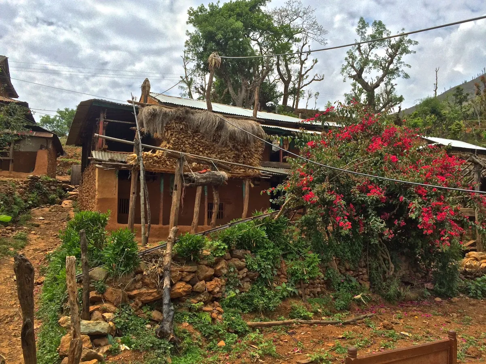
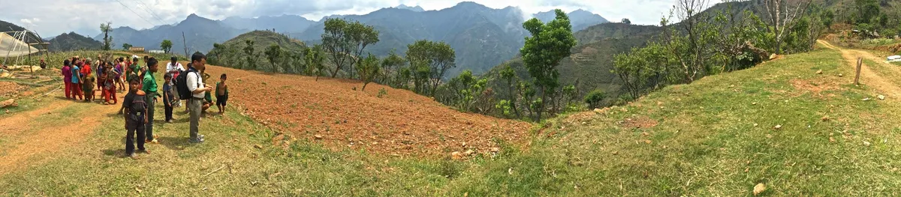
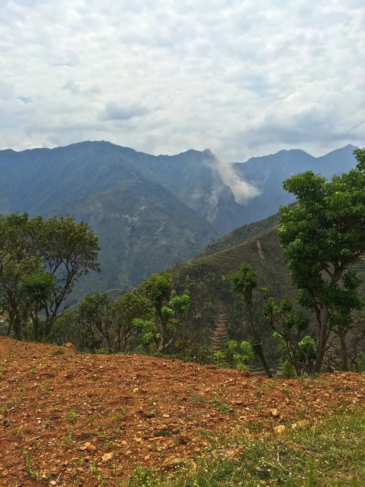
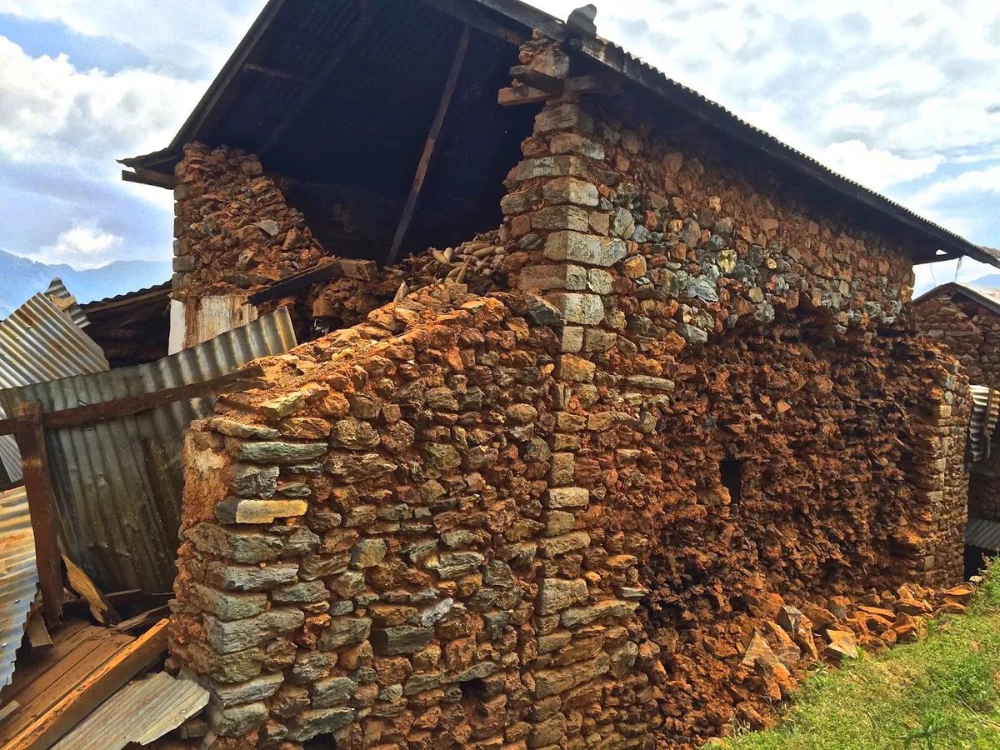
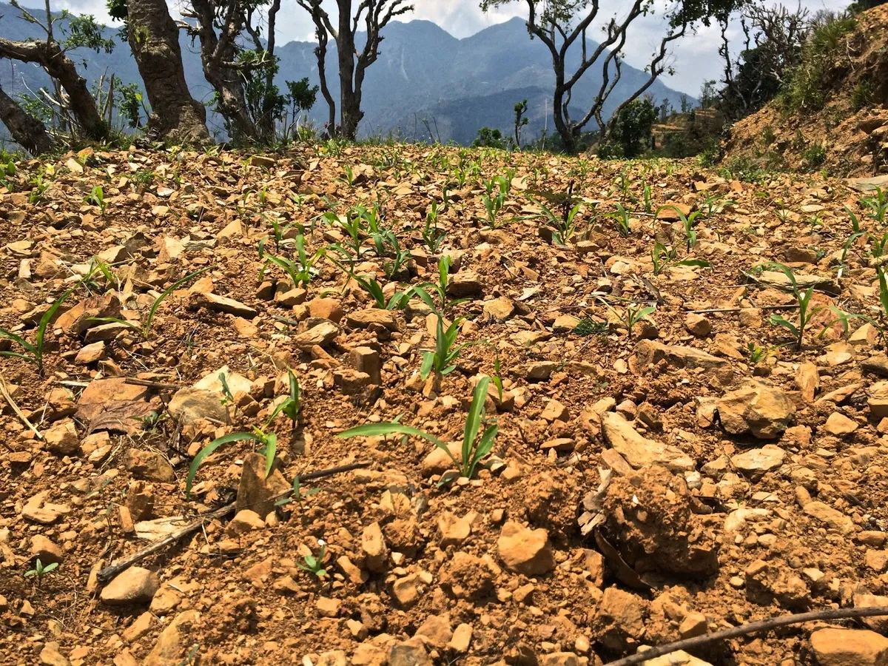
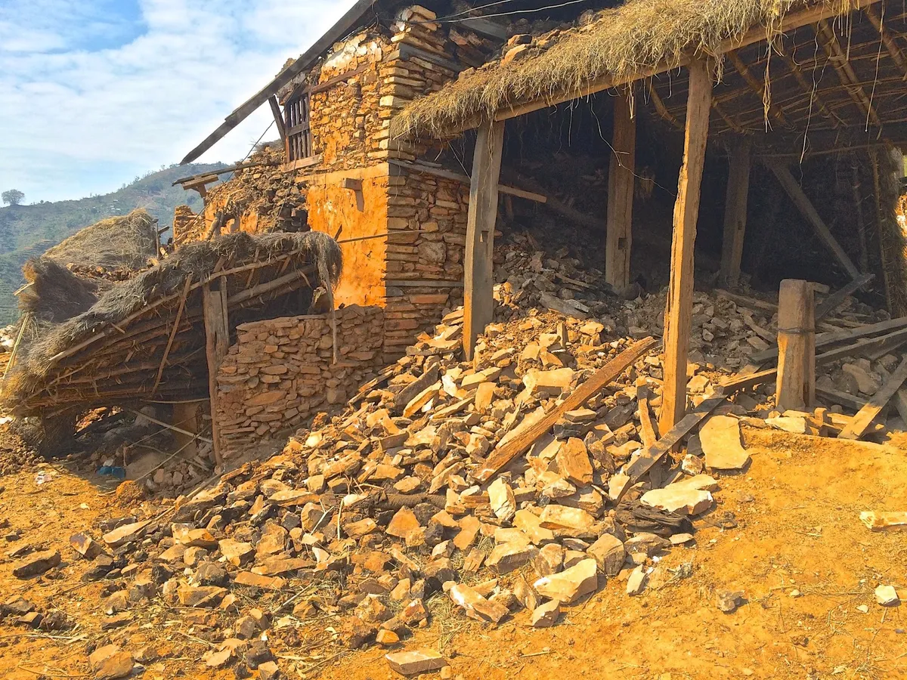
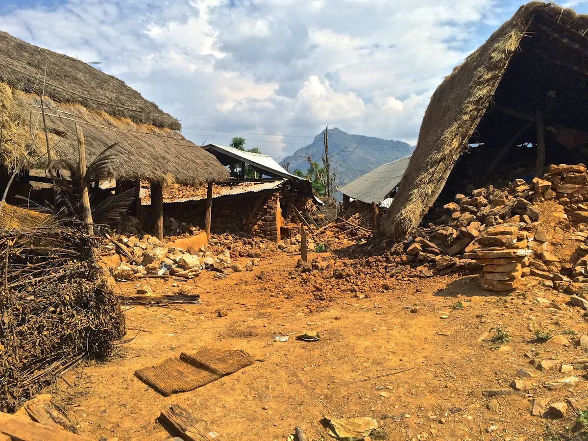
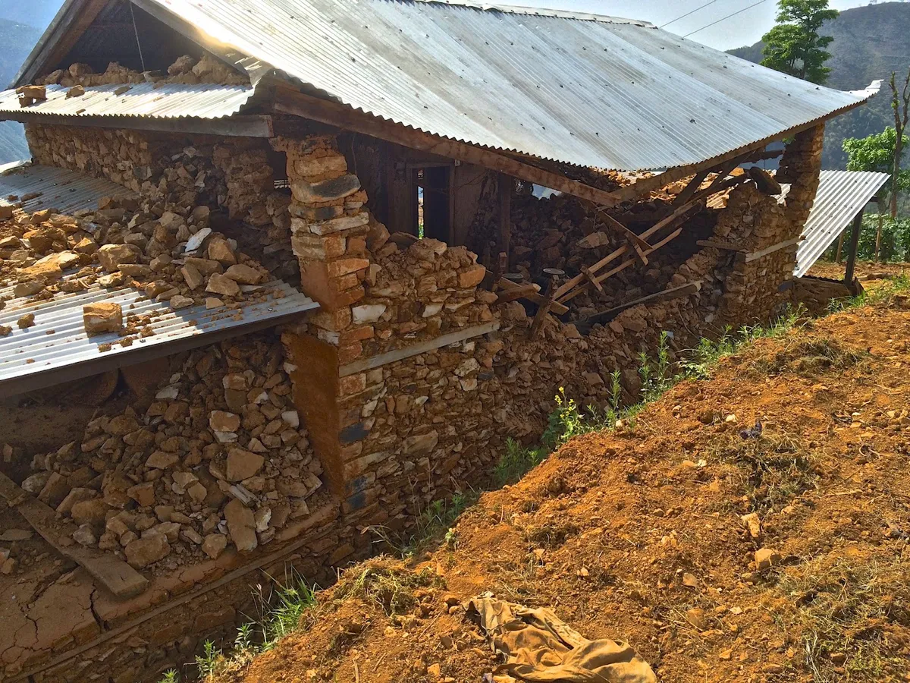
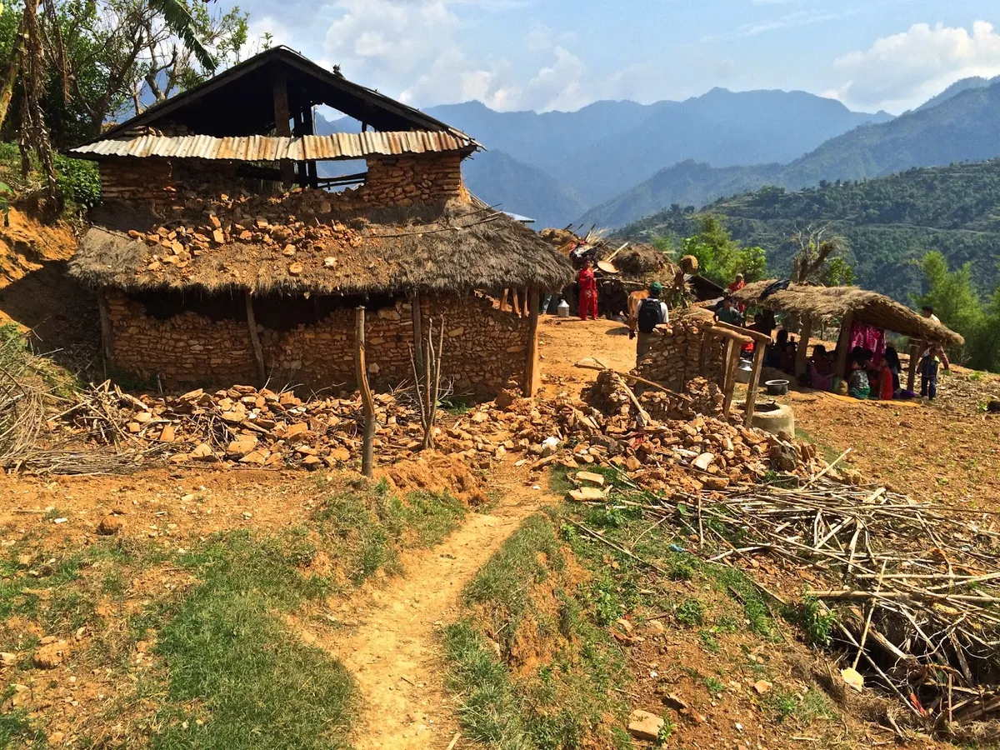
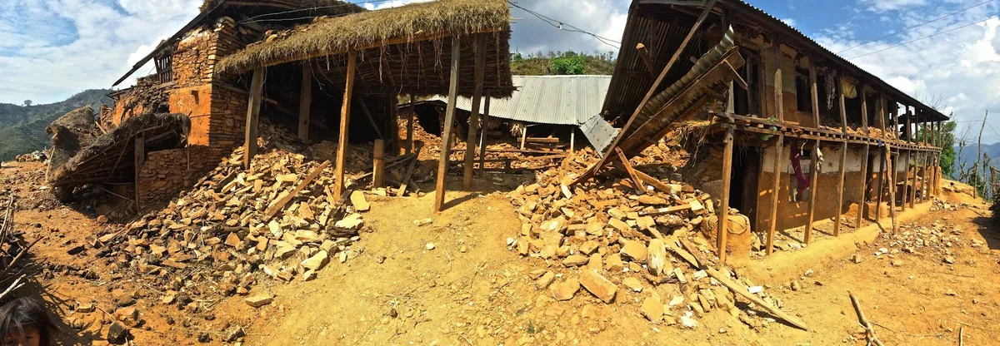

The earthquake that struck Nepal in April 2015 has been one of the most prominent catastrophes in the history of the country and the biggest earthquake in Nepal since 1934. The magnitude of the earthquake was 7.8-8.1, the epicentre was between Lamjung लमजुंग and Gorkha गोरखा districts. The death toll is now approaching 5,000 and estimates are placed around 10,000. I was in Gorkha district conducting fieldwork at the time of the earthquake and am feeling very lucky to be alive and well.

After two days meeting with farmers from Jogimara जोगीमारा VDC in Purkot पुरकोट and Majhimtar मझिमतर I prepared to head up the hill to visit field sites in Gorkha district. At noon on Saturday, April 25th[^date], I was sitting in a small shop on the road to Bhumlichowk भुम्लिचोक above the Trishuli त्रिशुली river when the walls and roof began to shake. Myself, two researchers from LI-BIRD, and a number of locals ran outside seeking shelter. The ground shook violently for what felt like 2 or 3 minutes. Rocks and boulders rolled down the steep hillside. The suspension bridge swayed back and forth nearly tossing two young boys into the river. Screams echoed in every direction. I immediately backed up against a concrete support wall for shelter from the falling rocks, from there I observed the chaos.

When the first quake calmed I climbed up to a small village nearby. Nobody was hurt, one house collapsed partially, and the whole village waited anxiously in a small open area. I spoke with the locals in broken Nepali, it was the worst earthquake any of them had experienced. My two Nepali companions were very shaken but confident, so we continued into the hills on the road to Bhumlichowk with 12 other locals in the back of a truck. On the way up into the hills we saw many villages in ruin, collapsed homes littered the majestic hillside.

We reached Bhumlichowk safely, ate dal bhat and raksi with a family in the village, and took shelter for the night. I stayed in a small guest room attached to a shop and slept with the door open, the cool air calming my nerves. Tremors woke me three times through the night; each time I sprung from my bed and stood half naked in the cold, feeling the earth shake beneath my feet. The next day we walked towards Thumka, stopping occasionally to chat with locals and observe collapsed buildings scattered along the hillside trail. After 3 hours of hiking we stopped in a village populated by about 50 Magar मगर people with large terraces covered in cucumber plants climbing bamboo poles. I took a photo of a building flanked by bright red begonias and felt a tremor beneath my feet.

Men, women, and children ran screaming from the village centre. We followed them into a clearing surrounded by cucumber plants and a view of the nearby mountains. This tremor had a magnitude of 6.7, we sat with the whole village anxiously watching the village homes shake and rocks falling from hillsides across the valley.

The Magar people fed us cucumbers and we sat chatting for about an hour, then we proceeded on the trail to Thumka. On the way we encountered another Magar village of about 30 people, the women and children were resting in large cloth tents strung on bamboo poles, the men were outside discussing the earthquake and how they will manage the loss of their homes. These people cultivated the most rocky soil I have ever seen.

After another hour hike we reached Thumka ठुमका. The damage was worse that I could have imagined. The village has about 60 inhabitants who cultivate very rocky and infertile soil for subsistence. Almost every house in the village had collapsed. Only one house in the whole village had all walls in tact, they were covered in large cracks.

We sat with the villagers for the afternoon and discussed the disaster what aid they require most. There was a need for materials to make emergency shelters to protect the village from monsoon rains, non-perishable food, sanitation supplies and new toilets, and medicine. We decided to leave before the sun went down; after a four hour hike we reached Majhimtar, the bottom of the hill, and the Trishuli river. I slept outside with the villagers and left to Pokhara the next day. For two hours I watched full buses pass the village carrying people from Kathmandu, most buses had as many as 10 or 15 people sitting on the roof. When I finally caught a bus to Pokhara it took 8 hours to travel 100km. The highway was jammed with traffic, stuck behind landslides that left the road littered with rocks. Things in Pokhara seem quite safe with relatively little damage from the earthquakes.

The situation in Nepal is still quite grim. The death toll rises as search teams reach remote communities. For my friends back home in Canada who wish to donate, my colleagues at the University of Guelph have set up a website and are collecting funds to support the relief aid. The website address is `www.youcaring.com/ggnc-fund`

To see my photos of the disaster, visit: `goo.gl/TMk5R7`

[^date]: The original post said “May 25th”. This was corrected to April 25th when the post was restored.
