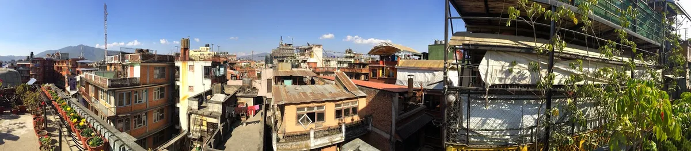

Even though its winter in Bombay the warm humid air is a relief after months of winter in Canada. Its 3:30am and I'm sitting with a Nepali and Tibetan family of 4 in the departure gate of Mumbai international airport. The hairs on the back of my neck stand as a breeze blows across moist skin.

I am travelling to Nepal to participate in a project between the University of Guelph, Canada, and LI-BIRD, a NGO from Pokhara, Nepal. The project is funded by the International Development Research Council (IDRC) of Canada- Canadian International Food Security Research Fund (CIFSRF). My masters thesis at U of G is about selecting drought tolerant livestock forages for the hill terraces in the dry season. After 4 days in Kathmandu I will travel to Pokhara to participate in a conference with the team from U of G and LI-BIRD.

In the next few days I will gather supplies and familiarize myself with the people and culture of Nepal, stay tuned for more!

