I flew to Pokhara on Saturday and enjoyed two days before meeting the LI-BIRD team. See how cool Kamal looks on his bike!

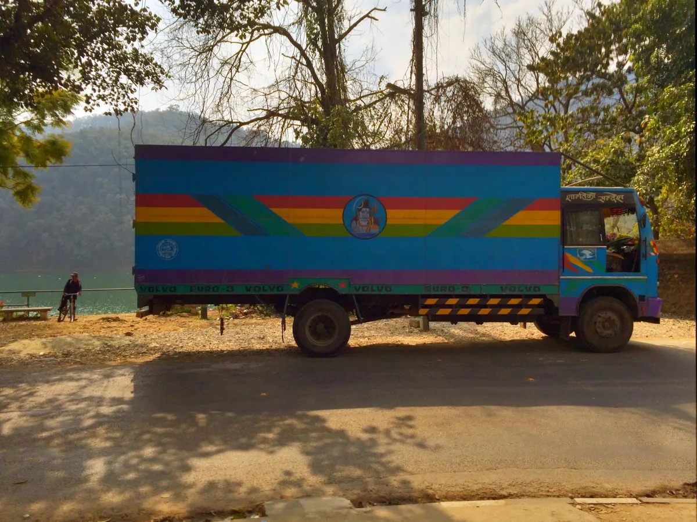

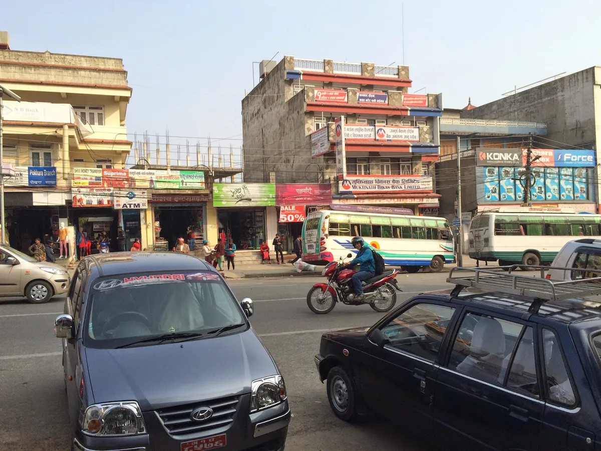

Yesterday the teams from The University of Guelph, IDRC, and LI-BIRD met in Pokhara, Nepal, for the first field visit of the season. We drove for 40 minutes along narrow winding roads up into the hills to a nearby village. As we got out of the van we were greeted by a happy child wearing a baptism dress over a blue hoodie, we passed through metal gates into a worn down community centre built by Rotary International in the 50's.

The women said a blessing, made bindi in between my eyes, and placed bright red rhododendron flowers in my lap- continuing clockwise around the circle doing the same to each participant.

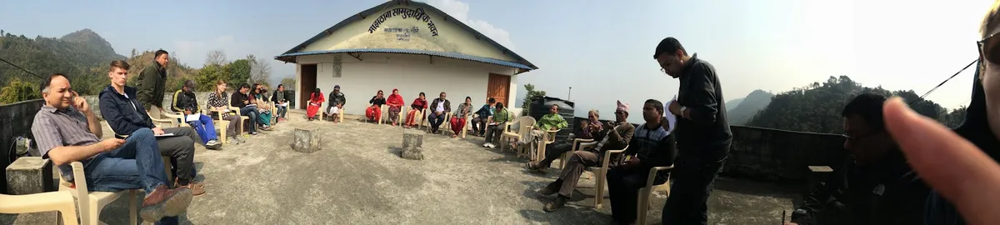

The meeting lasted for a few hours. We asked many questions about the challenges of farming terraces in the hills. Afterwards we ate dal bhat and some chicken from the village. Then we walked through the hills for 4 or 5 hours. I noted the terrace crops; a lot of mustard, wheat intercropped with pea, lentil, and potato; in the home gardens the bananas were almost ripe, tomatoes green, papaya was large and juicy, and the occasional mandarin.

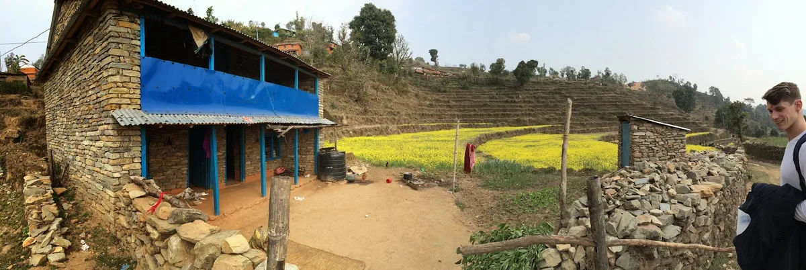

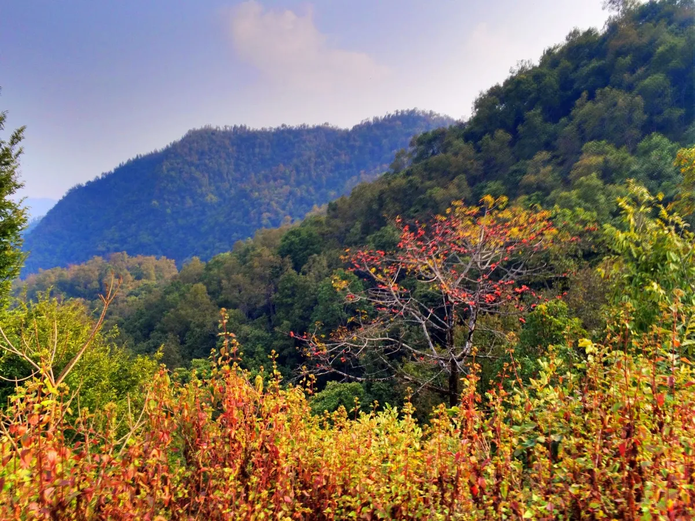

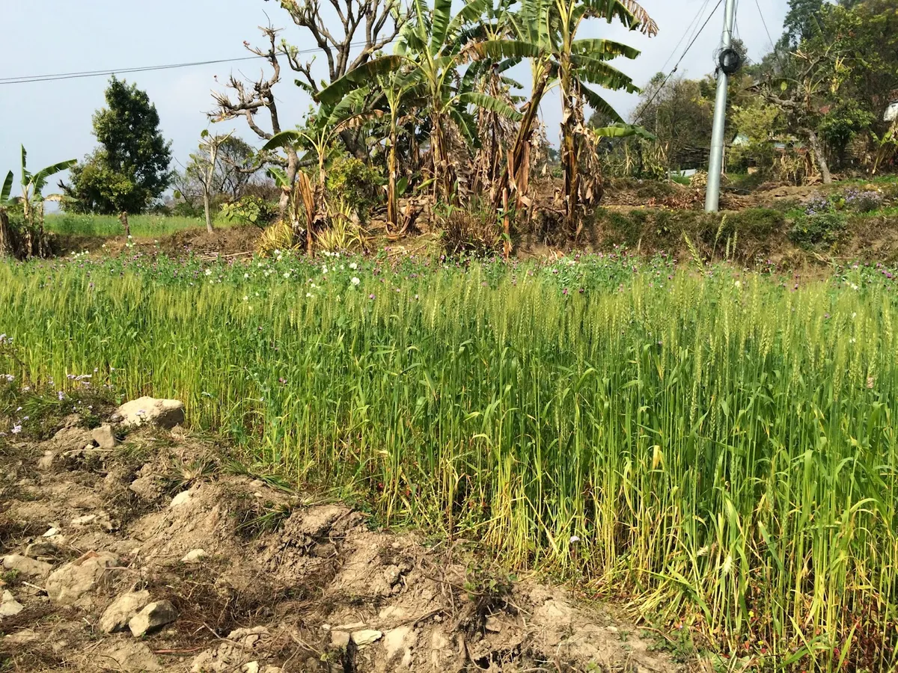

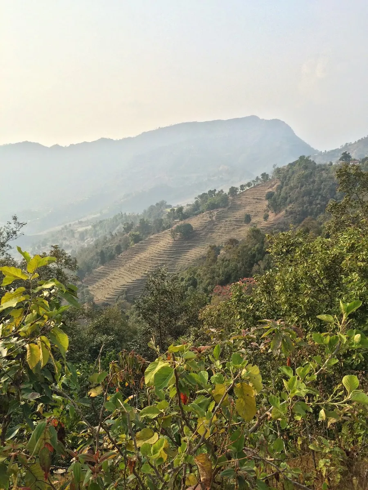

See the stone rainwater reservoir- which collected water from the roof, funnelled through split bambu.

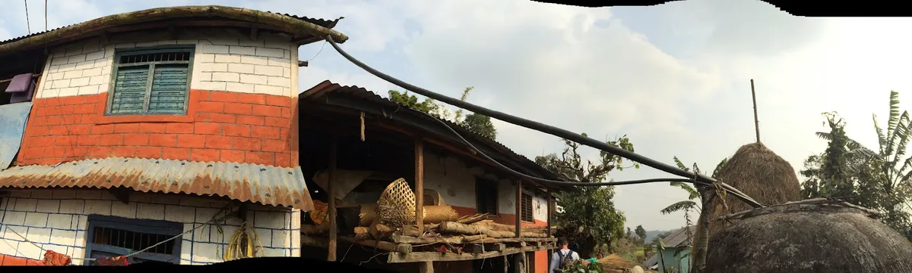

Kem Raj Chowi of LI-BIRD taught the local women to make biochar. Everyone seemed enthusiastic about the process.

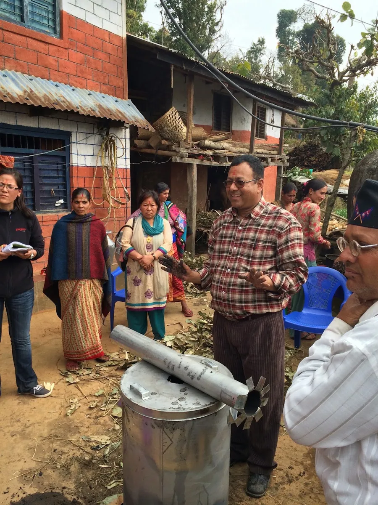

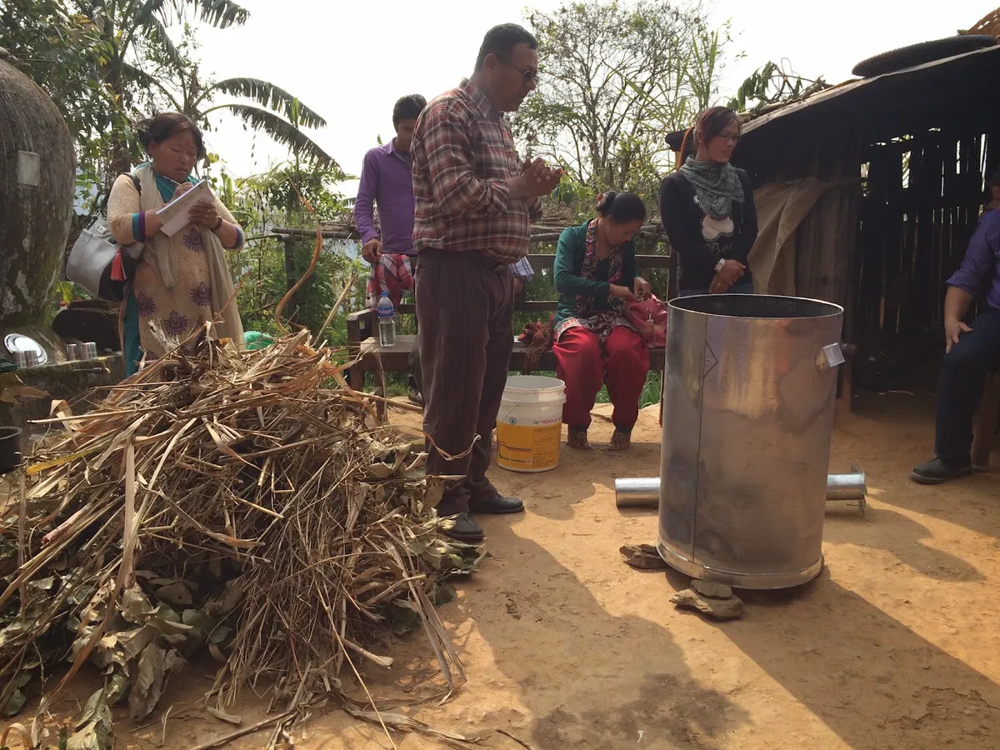

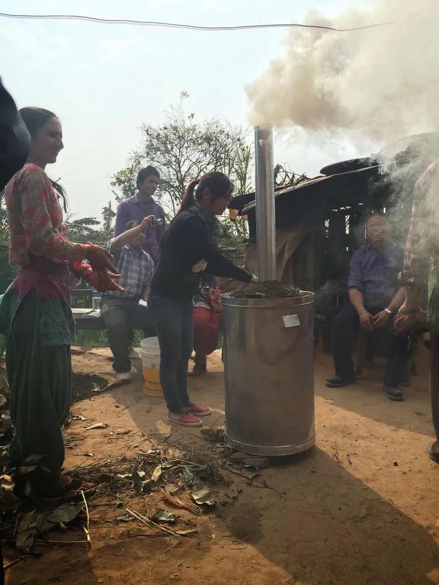

A little girl watched pensively and a small goat jumped on the stone wall, also check out the stack of millet straw.

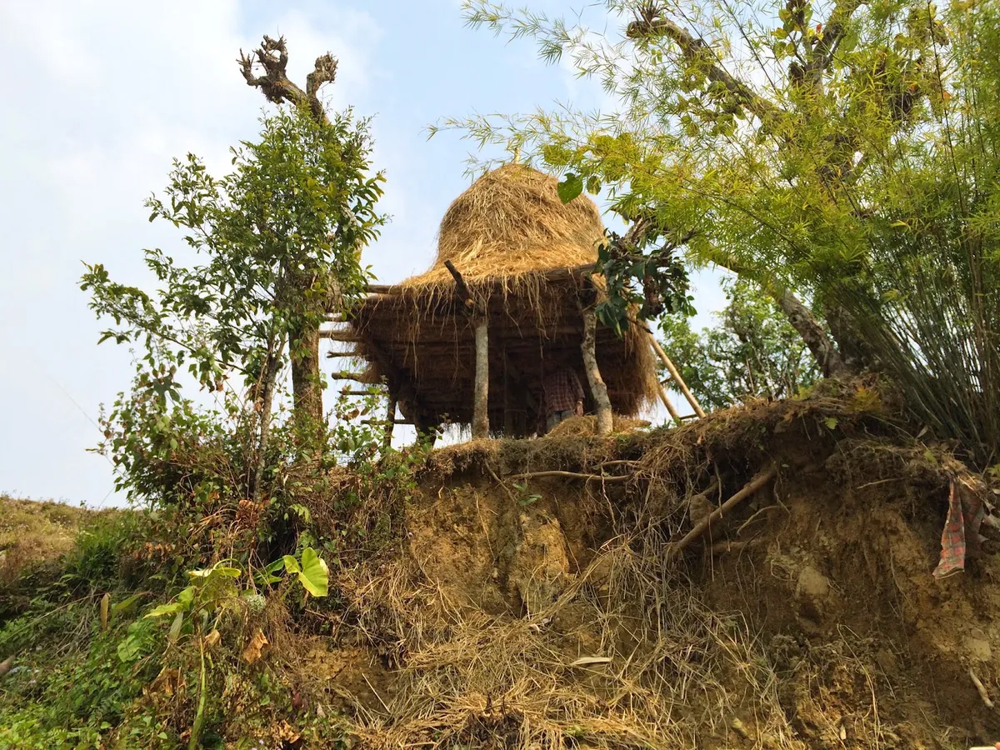

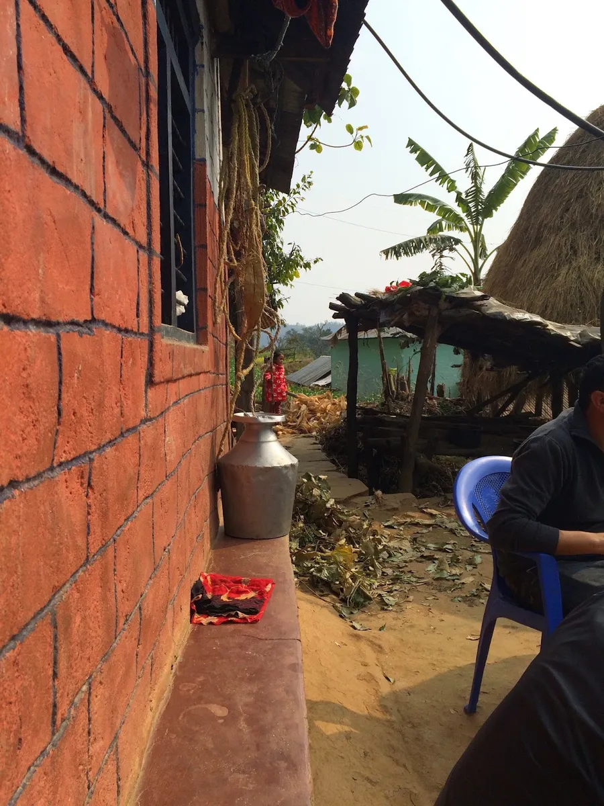

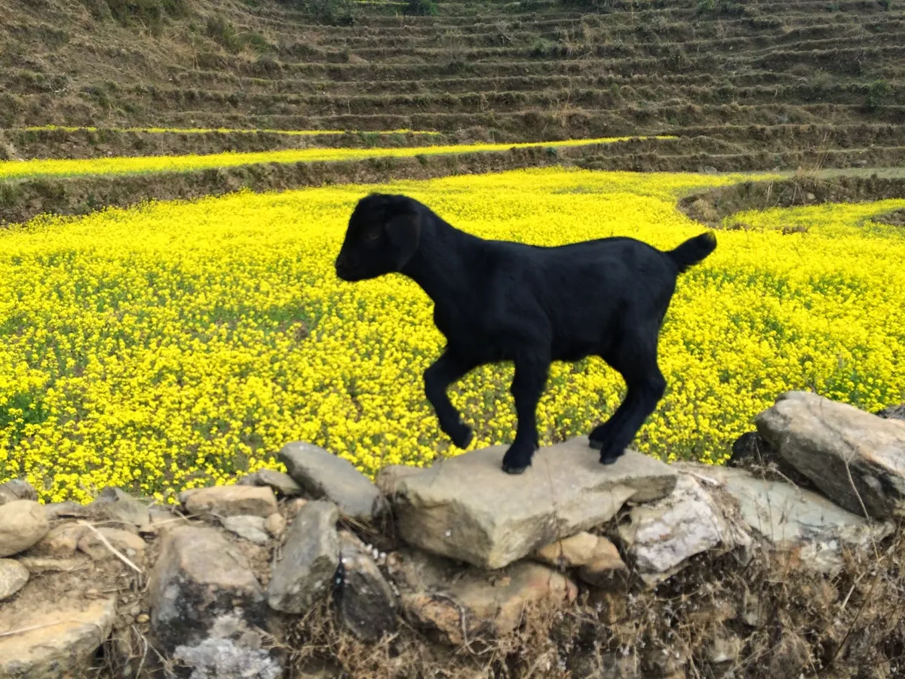

My first day in the hills of Nepal was wonderful. I'm very excited for what is to come!

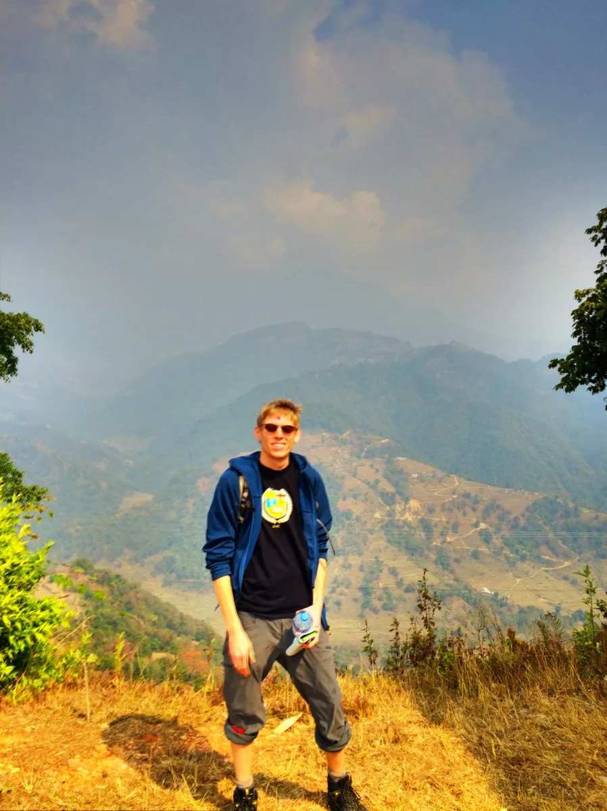

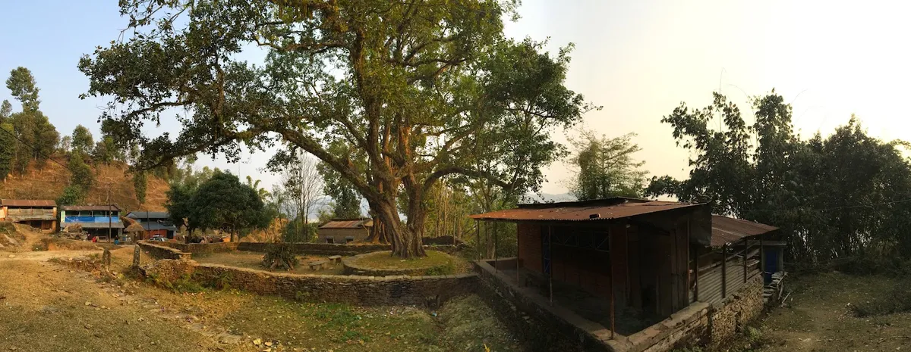
