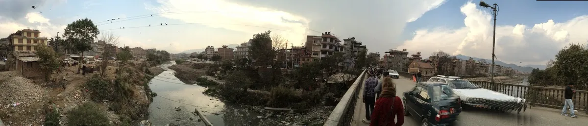
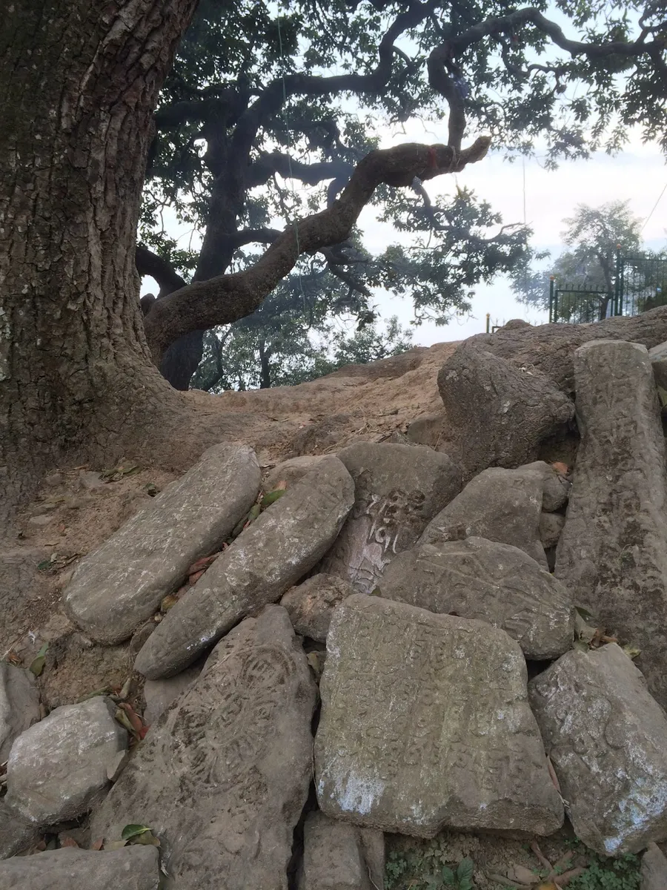
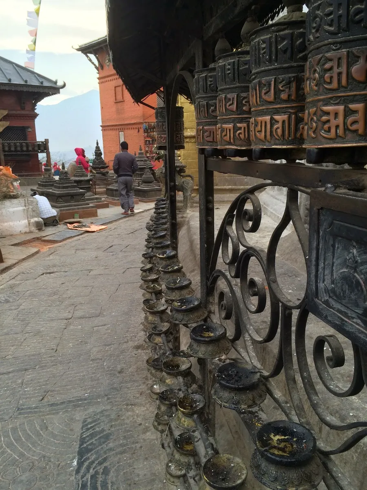
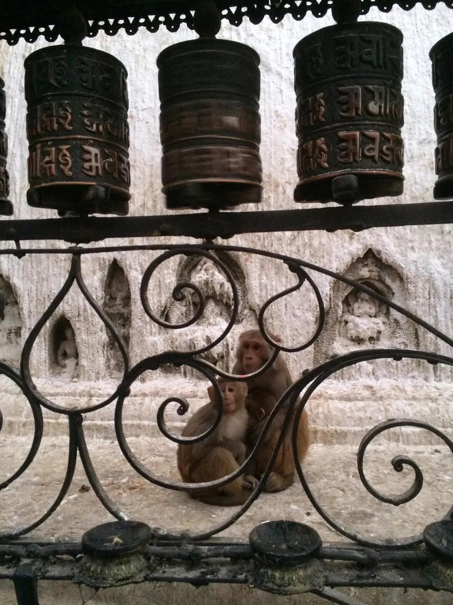
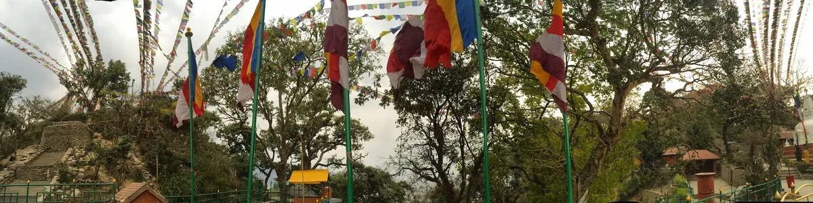
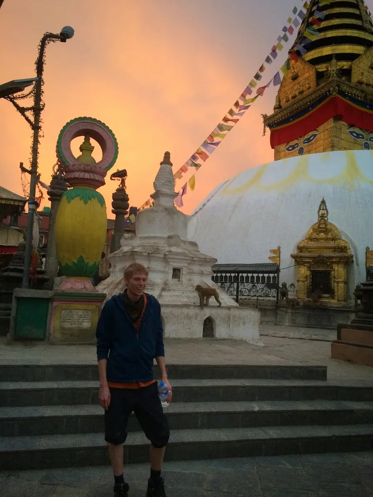
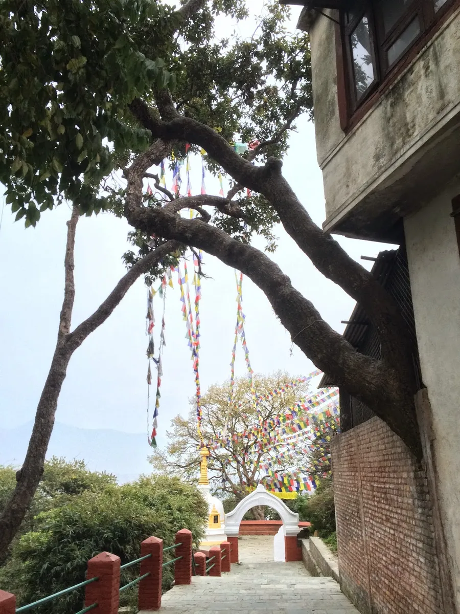
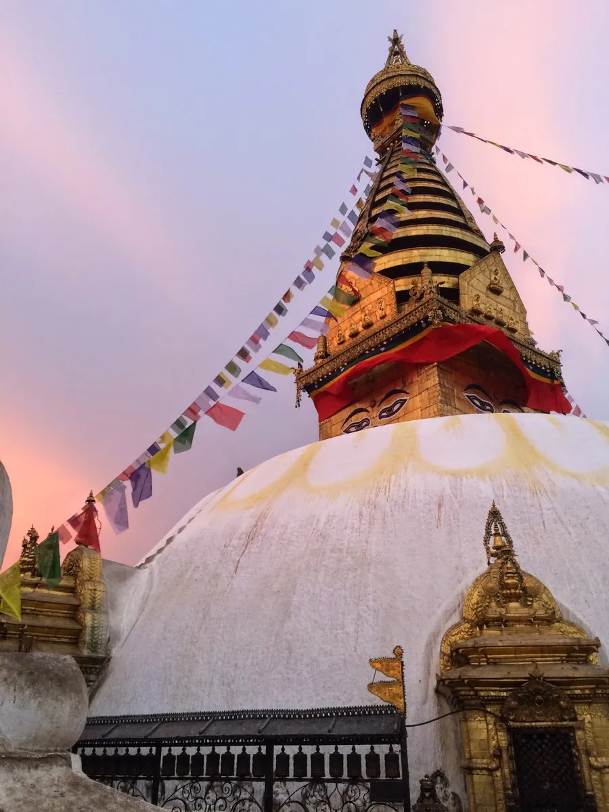
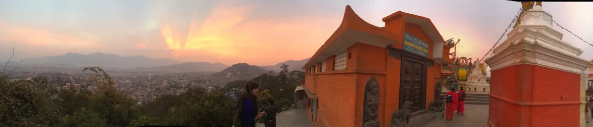

Swayambhunath is one of the most sacred buddhist pilgrimage sites. I walked to this beautiful temple with three lovely travellers from Alaska, whom I met at the hotel Potala in Thamel. On our way we crossed the Bishnumati river, littered with garbage; plastic, poultry and swine carcasses being eaten by stray dogs, and a revolting stench.

Another 20 minutes of walking brought us to a the foot of a massive staircase. Up we climbed; meeting children, beggars, and artists carving "Namaste" into stone circles and and stitching beautiful designs into fabric. When we reached the top of the staircase a guard asked us for 200 rupees, we obliged and entered the temple.

It is hard to prepare for the sights that followed. The beauty of this temple is astounding. Monkeys ran freely, hundreds of them inhabit the holy site. The golden stupa is breathtaking, the eyes of Buddha overlooking the Kathmandu valley. Prayer flags stretched a half a kilometre long between branches of distant Ficus (religiosa [mother] and benghalensis [father]). Tibetan buddhists struck a strong rhythm inside the temple, so strong my heartbeat fell in sync.

We stayed until sunset rays pierced the sky and then retuned to Thamel for a nice dinner and a deep sleep.

